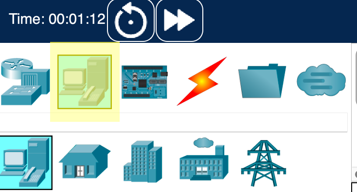
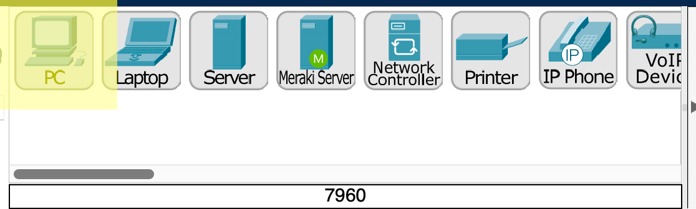
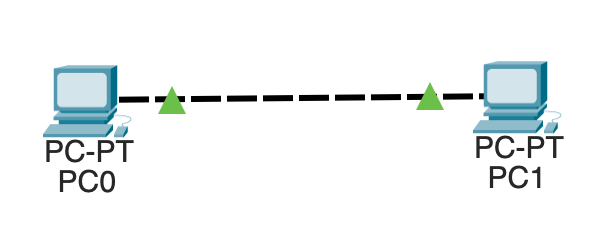

# 项目: 数据包跟踪器：连接两台电脑

在本项目中，我们准备使用Cisco's [fl[Packet Tracer|https://www.netacad.com/courses/packet-tracer]]工具来搭建一个简单的网络，这个工具是免费的！如果你没有安装它，可以从这里[Appendix: Packet Tracer](#appendix-packettracer)查看到安装步骤。

如果在任何时候你犯了一个错误，需要删除，只需要从第二个图标行选择“Delete”工具即可。

## 向局域网中添加计算机

在左下方选择"End Devices"。



然后将两个“PC”拖到中下面板的工作区域。



## 将PC机用网线直连

现在，在你的工作区有两台计算机了，让我们将他们直连起来。

点击左下角的"Connections"按钮。


点击中间下面的"Copper Cross-Over"图标（该图标会在点击后变成"anti" 符号。）


点击其中的一个计算机，选择"FastEthernet0"。

点击另一个计算机，同样选择"FastEthernet0"。

此时，你应该可以看到类似下面的内容:



## 设置网络IP

这两台电脑都没有IP地址。我们将用我们选择的静态ip设置它们。
1. 点击PC0。
2. 点击"Config"面板。
3. 在侧面点击"FastEthernet0"。
4. 在"IPv4 Address"一栏,输入`192.168.0.2`。
5. 在"Subnet Mask"一栏，输入 `255.255.255.0`。

关闭配置窗口。

以相同的步骤配置PC1，除了在IP地址输入`192.168.0.3`，在结束时，关闭配置窗口。

## 在网络中ping联通性

让我们从PC0 ping PC1，以确保我们的网络是正确连接的。
1. 点击PC0，选择"Desktop"标签页。
2. 点击"Command Prompt"。
3. 在命令行窗口，输入`ping 192.168.0.3`。

> 当你开始ping时，第一个ping有可能会因为开始ARP而导致超时，在复杂的网络中，多次的ping可能会在成功之前超时。

当ping成功时，你应该会看到如下消息:
``` {.sh}
C:\>ping 192.168.0.3

Pinging 192.168.0.3 with 32 bytes of data:

Reply from 192.168.0.3: bytes=32 time<1ms TTL=128
Reply from 192.168.0.3: bytes=32 time<1ms TTL=128
Reply from 192.168.0.3: bytes=32 time<1ms TTL=128
Reply from 192.168.0.3: bytes=32 time<1ms TTL=128

Ping statistics for 192.168.0.3:
    Packets: Sent = 4, Received = 4, Lost = 0 (0% loss),
Approximate round trip times in milli-seconds:
    Minimum = 0ms, Maximum = 0ms, Average = 0ms
```
如果你看到多于两次的`Request timed out.`，那么配置一定有错误了。

``` {.sh}
C:\>ping 192.168.0.3

Pinging 192.168.0.3 with 32 bytes of data:

Reply from 192.168.0.3: bytes=32 time<1ms TTL=128
Reply from 192.168.0.3: bytes=32 time<1ms TTL=128
Reply from 192.168.0.3: bytes=32 time<1ms TTL=128
Reply from 192.168.0.3: bytes=32 time<1ms TTL=128

Ping statistics for 192.168.0.3:
    Packets: Sent = 4, Received = 4, Lost = 0 (0% loss),
Approximate round trip times in milli-seconds:
    Minimum = 0ms, Maximum = 0ms, Average = 0ms
```

## 保存该项目

请确保你保存了项目，如果你这样做了，你将会得到一个后缀名为`.pkt`的文件。
<!--
计分表

5
使用了交叉电缆

5
使用了两个PC

5
PC都设置了正确的IP地址

5
可以从一个PC成功的ping到另一个
-->