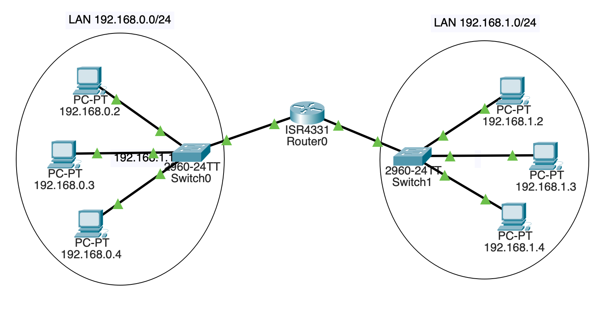

# 项目: 数据包追踪器：使用一个路由器

我们将在数据包跟踪器项目中的两个独立网络之间添加一个路由器。这次需要完成的目标大约如下所示:

## 搭建局域网

首先，我们需要建立两个独立的局域网。像以前一样，每个人有三台pc和一个2960交换机。在这里左边的子网将会是`192.168.0.0/24`。右边的子网将会是`192.168.1.0/24`。给左边的PC机的`FastEthernet0`接口上都设置下如下IP:

* `192.168.0.2`
* `192.168.0.3`
* `192.168.0.4`

给右边的PC机的`FastEthernet0`接口上都设置下如下IP:

* `192.168.1.2`
* `192.168.1.3`
* `192.168.1.4`

所有的这些PC机都有相同的子网掩码 `255.255.255.0`。将左边的PC机连接到其中一个交换机上的任何没有使用的`FastEthernet`端口上，将右边的PC机以同样的方法连接到另外一个交换机上。此时，你将拥有两个独立的局域网。

如果不是所有的链接都是绿色的，点击快进按钮。如果它们一直是红色，那就有问题了——你得再次检查你的设置。为了安全起见，请确保从`192.168.0.2` 可以ping通局域网上的其他两台机器。并确保从`192.168.1.3`也可以ping通LAN上的其他两台机器。

## 添加一个路由器

路由器的作用是在两个网络之中路由流量。

点击左下的"Network Devices"按钮，然后点击最底部的 "Routers"，接着将一个`4331`路由器拖到两个路由器之间。路由器将会同时连接到两个交换机上，路由器的每一“边”都有一个不同的IP地址。

我们将会在这里做一些连接线，不过 _连接还不会起来_, 下面我们将会处理此事。

对于位于`192.168.0.0/24`子网的交换机，使用一条铜直通线（Copper Straight-Through）将交换机的`GigabitEthernet0/1`端口连接到路由器的`GigabitEthernet0/0/0`端口。

对于位于`192.168.1.0/24`子网的交换机，选择同样类型的连接线将交换机的`GigabitEthernet0/1`端口连接到路由器的`GigabitEthernet0/0/1`端口。

注意，这是一个路由器其他交换机连接的不同的端口!两个交换机都插入路由器的不同端口。

我们现在有了硬件，但是我们还没有在路由器上分配任何IP地址。我们来完成该操作。

在路由器上的"Config"配置界面，选择`GigabitEthernet0/0/0`接口并且给它赋予一个IP地址`192.168.0.1`--现在它是子网`192.168.0.0/24`一部分。当你完成这一步之后，点击"On"来打开该端口上的电源。这一步会打开连接并显示绿色箭头。

接着，找到`GigabitEthernet0/0/1`接口，并且给它赋予一个IP地址 `192.168.1.1`--现在它是子网`192.168.1.0/24`的一部分。你完成这一步之后，点击"On"来打开该端口上的电源。

让我们尝试去ping另一个路由器，找一台位于`192.168.0.0/24`子网上的任一PC并且ping`192.168.0.1` （路由器），此时应该会收到回复。接着找一台位于`192.168.1.0/24`子网上的任一PC并且ping`192.168.1.1`，此时应该会收到回复。

现在是终极测试: 打开PC机`192.168.0.2`的终端，并且尝试去ping位于另一个子网上的`192.168.1.2`。呀，这没有连通，那么这是为什么呢？

## 添加一个默认路由

所有的电脑现在需要知道以下两件事:

* 局域网的子网号是什么，以便它知道在局域网上路由本地流量。
* 一个 _默认网关_ 地址，位于局域网上的计算机需要知道该地址，这样才能把流量发送到局域网之外的地址。

我们已经添加了子网，但没有添加默认网关。

对于所有位于`192.168.0.0/24`子网上的计算机，点击"Config",选择侧边栏上的"Global"，在"Default Gateway"中输入`192.168.0.1`（我们的路由器！）

对所有位于另一个子网中的所有PC机做同样的设置，除了在这个子网中输入`192.168.1.1` 作为默认网关地址。

## 试一试！

现在你应该可以从任一PC ping到另一个PC！如果不能，请尝试只在一个局域网上ping以确保它能工作。然后ping一下局域网的路由器，来检测是否能正常工作。

<!-- 计分表
5 
在两个子网中使用了三台计算机

5
所有位于同一子网的计算机可以ping通另外一个

5
在两个子网中使用了两个交换机

10
在两个子网中，路由器接入的是不同的端口

10
每个子网都可以ping通它自己的路由器

5
每个计算机都可以ping通另一个子网中的另一个计算机

-->

