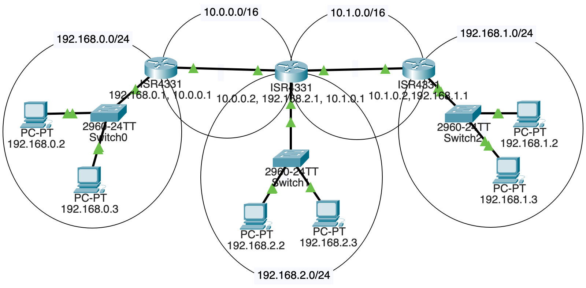
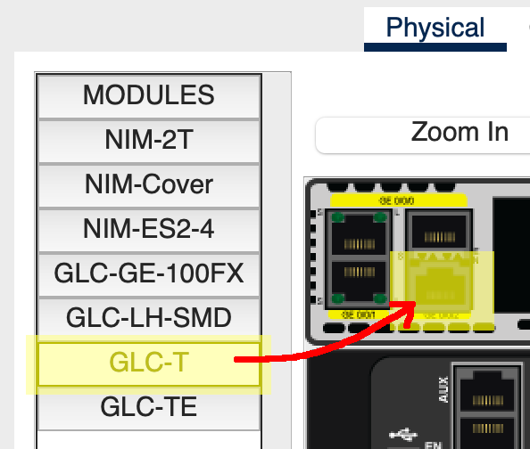

# 项目： 数据包追踪器：多个路由器

在上一个数据包追踪的项目中，我们在两个子网中间设置了一个路由器。在本项目中，我们将在两个子网中间设置多个路由器。这使问题变得复杂，因为每个路由器的路由表需要编辑，以便它知道如何转发数据包。

在一个庞大的局域网中，网关协议可以用来快速分发路由器所需的信息。但在我们的例子中，为了保持概念上的简单，我们只需要手动配置三个路由器中的路由表。

## 我们正在构建的

五个子网！

* 其中的三个是局域网:
  * `192.168.0.0/24`
  * `192.168.1.0/24`
  * `192.168.2.0/24`

* 剩下的两个位于两个路由器:
  * `10.0.0.0/16`
  * `10.1.0.0/16`

这里有一个示例图:


## 拖出组件

目前我们将需要:
* 每个局域网中有两台主机，所以一共有6台主机
* 3个2960交换机
* 3个4331路由器

每一个局域网都连接到一个路由器。其中两个路由器同时也连到另一个路由器。

不过，**这使得设置有点有趣的是**，中间的路由器和另外两个路由器**以及**另一个局域网相连！如图所示，在组件之间放置直通铜线连接。

## 设置中间的路由器

中间那个路由器需要连接另外两个路由器和一个局域网的?默认情况下，它没有足够的端口。我们需要给他增加一个端口。幸运的是，这是一个虚拟的的模拟，所以你可以模拟虚拟支付的新组件，而不必打开你真实的钱包。

选择那个路由器并且选择"Physical"标签页。点击"Zoom In"放大，这样可以看的更清楚些。电源开关在右侧。滚动到那里，点击它。(因为在断电之前不能添加组件。)

其中两个以太网连接器位于左上方。就在它们的右边，还有两个我们可以插入组件的端口。从左边的侧边栏，拖拽出一个"GLC-T"到这些端口上，如下所示:



最后，重新打开路由器的电源。

## 设置三个子网

我们使用如下子网:
  * `192.168.0.0/24`
  * `192.168.1.0/24`
  * `192.168.2.0/24`

按照惯例，路由器通常都是子网中的`.1`地址。例如:`192.168.2.1`。但是这不是必需的。在子网中给2台pc机和1台路由器分配IP地址，然后把它们都连接到一个交换机上。

确保路由器上正确的以太网端口在配置中被设置为“on”!完整性检查:一个子网上的所有计算机都应该能够相互ping通 **并且可以ping通**它们的路由器。

## 给所有主机都设置好默认网关

请记住，当从一个主机发送流量时，它们要么知道该发送到自己的子网上(因为目的地在同一个子网上)，要么不知道目的地IP在哪里。如果它们识别到IP不在同一子网上，它们会将流量发送到 _默认网关_，也就是那个一定知道如何处理目的地的路由器。

依次点击每台电脑。在侧边栏"Global/Settings"中的"Config"下，设置该局域网"Default Gateway"路由器静态IP。举例来说，如果我是`192.168.1.2`的PC机，而位于该子网的路由器地址是`192.168.1.1`，我将设置该PC机的默认网关是 `192.168.1.1`。

实际上，我会把局域网上所有pc的默认网关设置为该值。接下来，对另外两个子网执行相同的操作。

## 设置路由器子网

为了路由器能够正确的工作，我们需要在左边和中间路由器之间设置一个子网，在中间和右边之间设置另一个子网。

我们使用如下子网:
  * `10.0.0.0/16`
  * `10.1.0.0/16`


这意味着左右路由器将有两个IP地址，因为它们连接到两个子网。但是中间路由器将有三个IP地址，因为它连接到三个子网!(即其中连接到一个局域网，而其他两个连接到另外两个路由器。)

如果你还没有这样设置，请使用铜线直通连接连接子网。

## 设置路由表

我们快要完成了，不过如果你使用`192.168.0.2`地址去ping`192.168.1.2`，将无法了产生连通的流量。这是因为位于子网`192.168.0.0/24`的路由器很笨不知道从哪里可以发送出要到达`192.168.1.2`的数据包。

我们需要将这个部分补上。

我们将手动为每个路由器添加“静态路由”，这样它们就知道要将东西发送到哪里。如之前章节介绍的，在实际的局域网中，更常见的是使用网关协议来自动设置这些路由表。

但这是我们这里是学习目的的实验，如果使用网关协议自动添加有什么好玩的?(实际上，这一节将是一个非常有用的练习，但是该知识也是一个 _非常有用_ 的知识点。)

让我们再次来查看下网络图表:


如果一个数据包是需要从左边的`192.168.0.3`发送到`192.168.1.2`（右边），它怎样才能到达那里？我们可以看到它必须通过所有三个路由器。但是当它到达第一个地址`192.168.0.1`(LAN的路由器)时，该路由器将会把它发送到哪里?

好吧，从那里，数据包将从 `10.0.0.0/16` 子网出发到路由器`10.0.0.2`。

因此，我们必须为最左边的路由器添加一条路由，说:“嘿，如果你得到了子网`192.168.0.0/24`的任何信息，请将其转发到 `10.0.0.2`，因为它是途中的下一跳地址。”

我们点击最左边的路由器，然后进入“Config”，接着进入左侧栏的“Routing/Static”。将目的地对应“Network”和“Mask”字段填入对应信息，“Next Hop”是我们应该转发到流量的路由器。

在图中，我们像这样将一个路由器连接上最左侧的路由器(回想一下' `\24`网络的掩码是 `255.255.255.0`):

``` {.default}
Network:  192.168.1.0
Mask:     255.255.255.0
Next Hop: 10.0.0.2
```
我们已经快要完成了！但是，可悲且重要的是，目前中间路由器也不知道将`192.168.1.0/24`的流量发送到哪里。因此，我们必须添加一条路由到中间路由器，使其能够将数据包发送到下一跳，但这次位于它的`10.1.0.0/16`接口之外:

``` {.default}
Network:  192.168.1.0
Mask:     255.255.255.0
Next Hop: 10.1.0.2
```

现在，大功告成！IP为`10.1.0.2` 的路由器有一个连接到`192.168.1.0/24`的接口。我们的原始数据包将到达`192.168.1.2`，并且它们还位于在同一子网上!这时路由器就知道它可以通过该接口发送相应的流量。

当然，这并不是我们全部都需要做的。

接下来，为每台路由器添加上所有非直连子网的路由表项。而每个路由器应该有两个静态路由表项，以便涵盖所有入站和出站流量。

## 试一试！

如果所有配置正确，你应该能够从任何PC ping通任何PC!路由器可以将流量正确的转发到其他局域网!

<!-- 计分表
15
三个局域网都正确设置

15
所有三个路由器都正确的连接到对应的子网

18
所有三个路由表都配置正确

-->

